### Escuela Colombiana de Ingeniería
### Arquitecturas de Software - ARSW

## Escalamiento en Azure con Maquinas Virtuales, Sacale Sets y Service Plans

### Dependencias
* Cree una cuenta gratuita dentro de Azure. Para hacerlo puede guiarse de esta [documentación](https://azure.microsoft.com/en-us/free/search/?&ef_id=Cj0KCQiA2ITuBRDkARIsAMK9Q7MuvuTqIfK15LWfaM7bLL_QsBbC5XhJJezUbcfx-qAnfPjH568chTMaAkAsEALw_wcB:G:s&OCID=AID2000068_SEM_alOkB9ZE&MarinID=alOkB9ZE_368060503322_%2Bazure_b_c__79187603991_kwd-23159435208&lnkd=Google_Azure_Brand&dclid=CjgKEAiA2ITuBRDchty8lqPlzS4SJAC3x4k1mAxU7XNhWdOSESfffUnMNjLWcAIuikQnj3C4U8xRG_D_BwE). Al hacerlo usted contará con $200 USD para gastar durante 1 mes.

### Parte 0 - Entendiendo el escenario de calidad

Adjunto a este laboratorio usted podrá encontrar una aplicación totalmente desarrollada que tiene como objetivo calcular el enésimo valor de la secuencia de Fibonnaci.

**Escalabilidad**
Cuando un conjunto de usuarios consulta un enésimo número (superior a 1000000) de la secuencia de Fibonacci de forma concurrente y el sistema se encuentra bajo condiciones normales de operación, todas las peticiones deben ser respondidas y el consumo de CPU del sistema no puede superar el 70%.

### Escalabilidad Serverless (Functions)

1. Cree una Function App tal cual como se muestra en las  imagenes.

2. Instale la extensión de **Azure Functions** para Visual Studio Code.

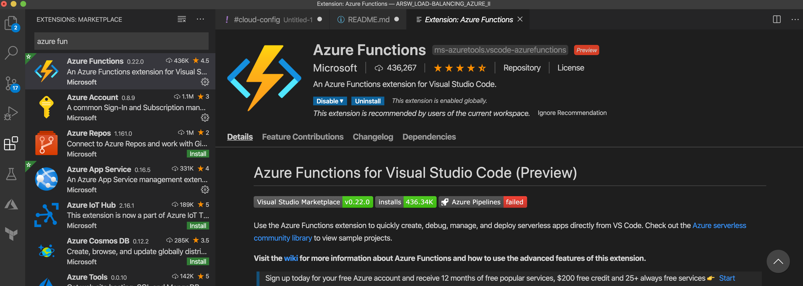

3. Despliegue la Function de Fibonacci a Azure usando Visual Studio Code. La primera vez que lo haga se le va a pedir autenticarse, siga las instrucciones.

4. Dirijase al portal de Azure y pruebe la function.

5. Modifique la coleción de POSTMAN con NEWMAN de tal forma que pueda enviar 10 peticiones concurrentes. Verifique los resultados y presente un informe.
    > El Objeto JSON utilziado para realziar las peticiones con postman y ejecuttarlas con newman es el siguiente:
    >
    > 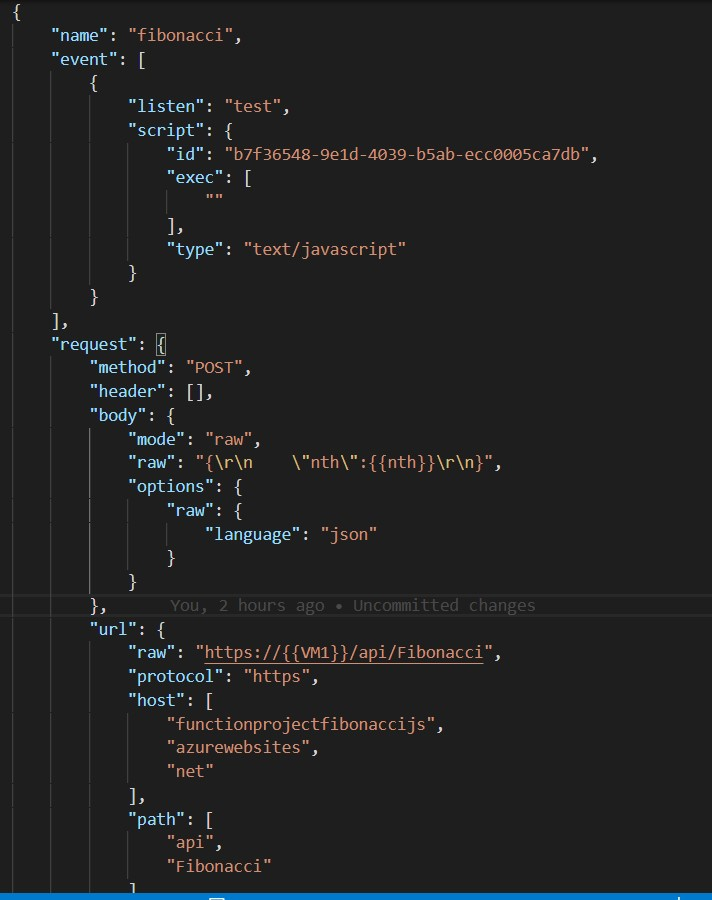
    >
    > El comando utilizado para la ejecucion concurrente de las 10 pruebas 
    > fue el siguiente:
    >
    > 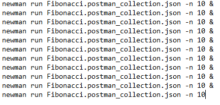

6. Cree una nueva Function que resuelva el problema de Fibonacci pero esta vez utilice un enfoque recursivo con memoization. Pruebe la función varias veces, después no haga nada por al menos 5 minutos. Pruebe la función de nuevo con los valores anteriores. ¿Cuál es el comportamiento?.
    > La implementacion de memoria realizada fue la siguiente, teniendo 
    > en cuenta que se mantiene el comportamiento anterior dado por la 
    > funcion:
    >
    > 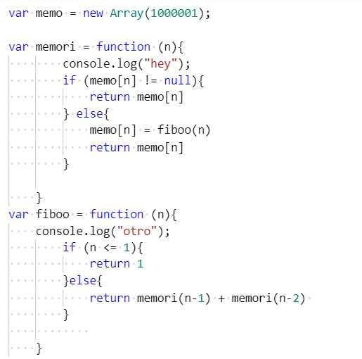
                                                                                                                                                                                                                                                                                                 
    > 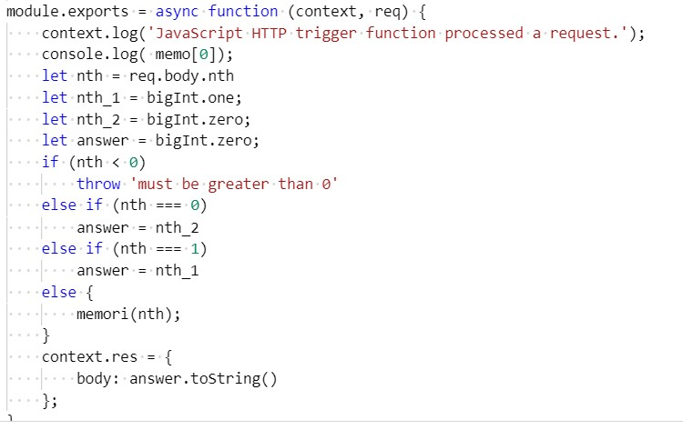                                                                                                                                                                                                                                                                                                                                                                                                                                                                                                                                                                                             
                                                                                                                                                                                                                                                                                                 
                                                                                                                                                                                                                                                                                                                                                                                                                                                                                                                                                                                                  
**Preguntas**

* ¿Qué es un Azure Function?
    > Azure Functions es un servicio en la nube disponible bajo demanda que proporciona toda la infraestructura y los recursos
    > continuamente actualizados necesarios para ejecutar sus aplicaciones.
    > Puede utilizar Functions para crear API web, responder a cambios en la base de datos, procesar flujos de IoT, gestionar
    > colas de mensajes y mucho más.
    >
    >Azure Function nos presenta una multitud de nuevos triggers para poder ejecutarlo. Entre todos estos triggers podemos 
    >encontrar: Cosmos DB, Event Hub y WebHooks.

* ¿Qué es serverless?
    > La computación sin servidor (o serverless para abreviar) es un modelo de ejecución en el que el proveedor en la nube (AWS, Azure o Google Cloud) es responsable de ejecutar un fragmento de código mediante la asignación
    > dinámica de los recursos. Y cobrando solo por la cantidad de recursos utilizados para ejecutar el código. El código, generalmente, se ejecuta dentro de contenedores sin estado que pueden ser activados por una variedad de 
    > eventos que incluyen solicitudes HTTP, eventos de base de datos, servicios de colas, alertas de monitoreo, carga de archivos, eventos programados (trabajos cron), etc.

* ¿Qué es el runtime y que implica seleccionarlo al momento de crear el Function App?
    > Un runtime environment carga todas las aplicaciones de un programa 
    > y las ejecuta en una plataforma, en Azure se tiene disponibilidad
    > de .NET, Nodejs, Pyhton y Java. Las implicaciones que esto trae
    > es que dependiendo el plan y la version de runtime se vera afectado
    > el tiempo de timeout y el intervalo de limpieza de el cache en
    > memoria
* ¿Por qué es necesario crear un Storage Account de la mano de un Function App?
    > Azure Storage contiene todos los objetos de datos de Azure Storage: blobs, archivos, colas, tablas y discos. 
    > La cuenta de almacenamiento proporciona un espacio de nombres único para sus datos de Azure Storage al que se puede acceder 
    > desde cualquier lugar del mundo a través de HTTP o HTTPS.

* ¿Cuáles son los tipos de planes para un Function App?, ¿En qué se diferencias?, mencione ventajas y desventajas de cada uno de ellos.

    > **Consumption:** El plan de consumo de Azure Functions se factura en
    > función del consumo de recursos y las ejecuciones por segundo. El
    > precio del plan de consumo incluye una concesión mensual gratuita
    > de 1 millón de solicitudes y 400.000 GB-s de consumo de recursos
    > por mes y por suscripción en el precio de pago por uso en todas
    > las aplicaciones de funciones de esa suscripción. El plan Azure
    > Functions Premium ofrece un rendimiento mejorado y se factura
    > por segundo en función del número de vCPU-s y GB-s que 
    > consuman sus funciones Premium.

    > **Premium plan:** El plan Azure Functions Premium ofrece las 
    > mismas funciones y el mismo mecanismo de escalado utilizado en el
    > plan de consumo (basado en el número de eventos) sin arranque en
    > frío, con un rendimiento mejorado y acceso a VNET. El plan Azure
    > Functions Premium se factura en función de la vCPU y la memoria 
    > que consumen sus funciones.

* ¿Por qué la memoization falla o no funciona de forma correcta?
    > La lista creada en el código no tiene la suficiente capacidad para almacenar datos de gran tamaño
                                                                                                                                      
* ¿Cómo funciona el sistema de facturación de las Function App?
    > Se factura en función del consumo de recursos y las ejecuciones 
    > por segundo.

* Informe

    > Como podremos observar en todas las peticiones se obtuvo un acierto 
    > del 100%, adicionalemente los tiempos varian entre 42.2s y 1m 16.5s, esto 
    > debido al tamaño de la solicitud y al nivel de procesamiento que este 
    > debe tener, los siguientes son los informes mostrados por newman:
    > 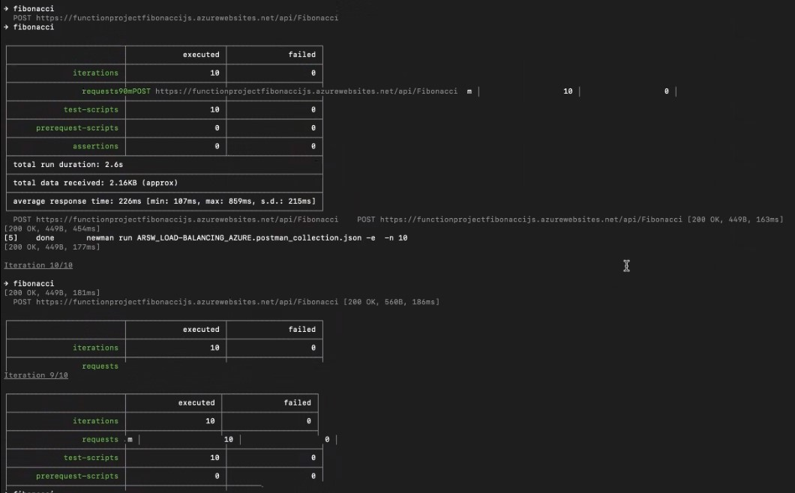
    > 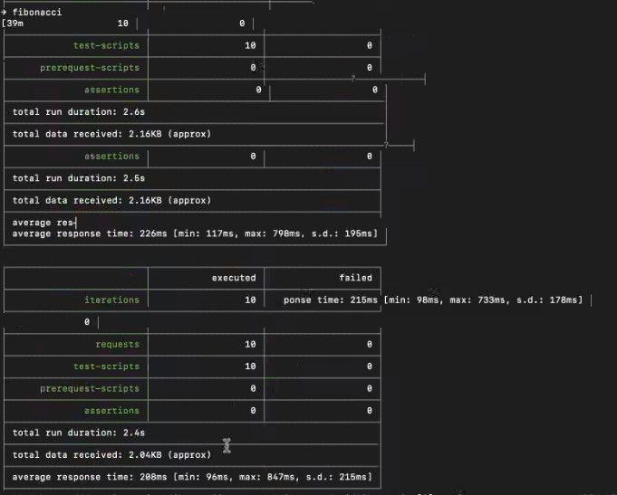
    > 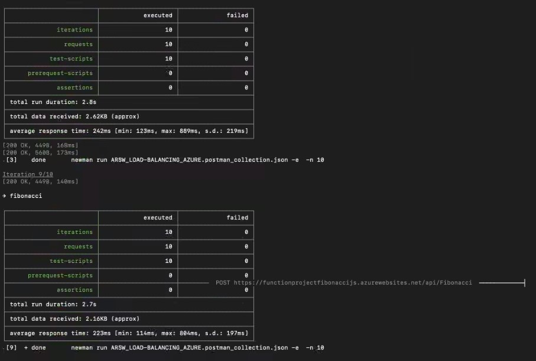
    > 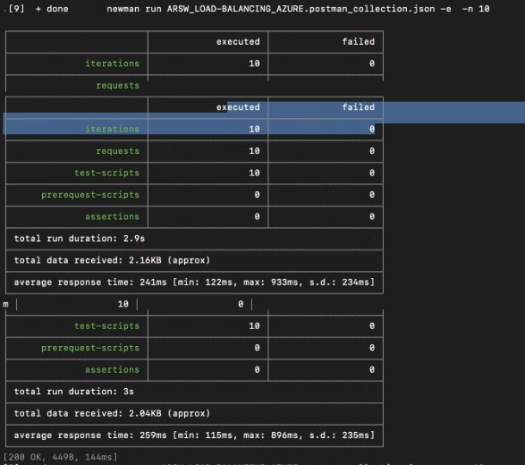
    > 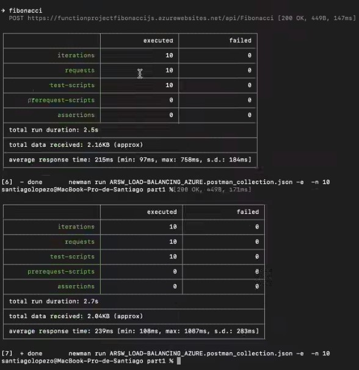
             
    > Despues de ejecutar la coleccion de postman podemos ver que estos son 
    > los compartamientos de la cpu y demas indicadores de la apliacion.

    >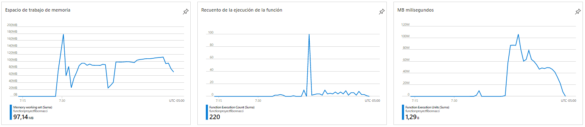
    >  **Conclusiones:**
          
    >   * Como podremos observar en todas las peticiones se obtuvo un acierto del 100%
    >   * El consumo de Cpu superó en algún momento el 70% por lo cual no se logró cumplir totalmente con este requerimiento documentado.
    >   * Se comporta mas rapido, sin embargo para numeros mayores a 1000 no es capaz de almacenarlos en la lista debido al gran tamaño que tienen y la respuesta se vuelve Infinity.                                                                                                                                                                                                                                                                                                                                                                                                                                                                                                                                                                                                                                                                                                                                                                                                                                                                                                                                                                                                                                                                                                                                                                                                                                    
                                                                                                                                                                                                                                                                                                                                                                                                                                                                                                                                                                                                                                                              
                                                                                                                                                                                                                                                                                                                                                                                                                                                                                                                                                                                                                                                              
                                                                                                                                                                                                                                                                                                                                                                                                                                                                                                                                                                                                                                                              
## Referencias

* https://docs.microsoft.com/en-us/azure/azure-functions/functions-scale

* https://azure.microsoft.com/es-es/pricing/details/functions/

* https://azure.microsoft.com/en-us/solutions/serverless/                                                                                                                                                                                                                                                                                                                                                                                                                                                                                                                                                                                                                                                             